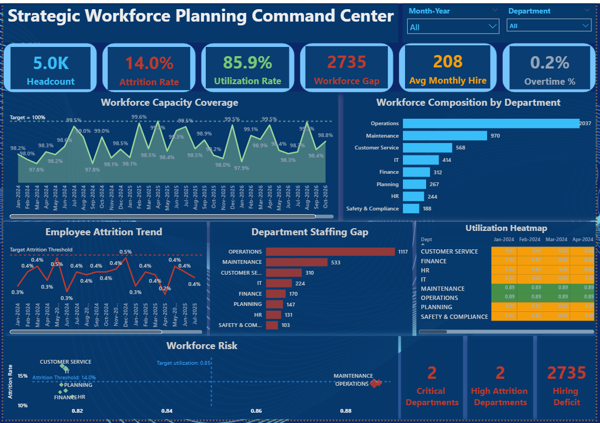
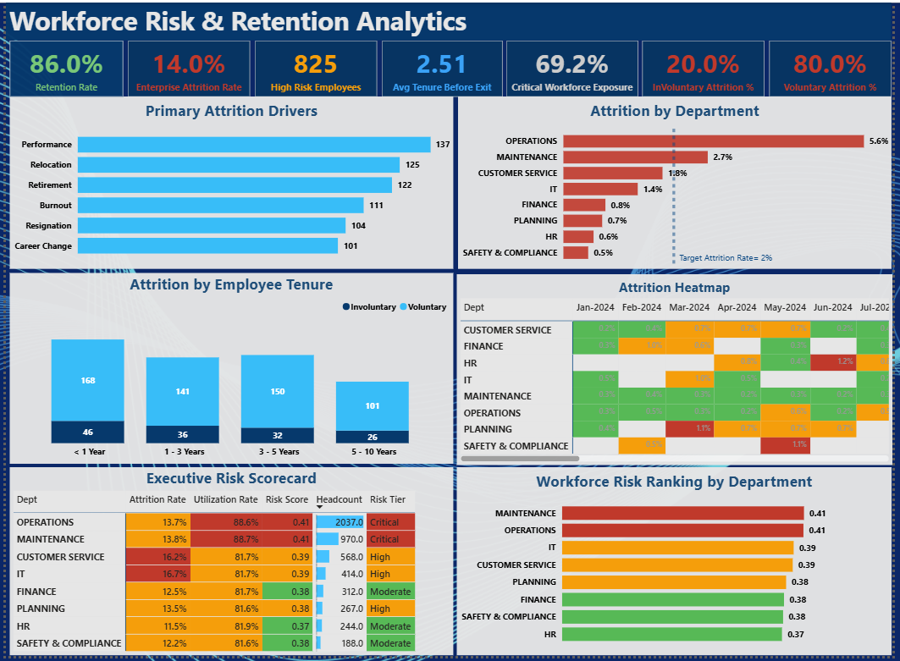
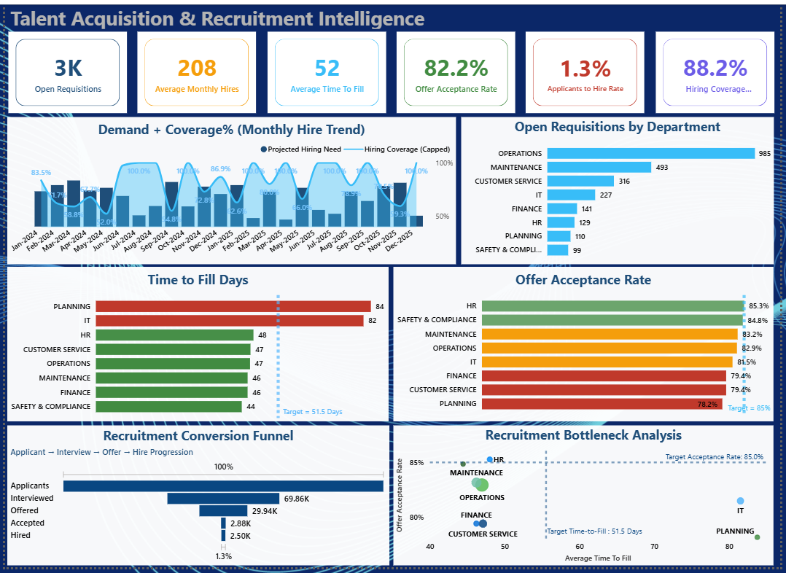

# 🚀 Enterprise Workforce Planning & Talent Intelligence Platform

### From Workforce Supply to Hiring Execution — A Unified Workforce Intelligence Solution

Built a multi-page Power BI platform that helps workforce leaders answer three critical questions:

✅ Do we have enough workforce capacity to meet future demand?

✅ Which departments face the greatest retention risk?

✅ Can recruiting close projected staffing gaps?

The solution integrates workforce planning, attrition analytics, and talent acquisition intelligence across **5,000 employees**, **8 departments**, and **24 months of workforce activity**.

---

## 📌 Executive Summary

Organizations often manage workforce planning, retention analytics, and talent acquisition as separate reporting functions, limiting visibility into workforce risks and future staffing needs.

This project consolidates workforce supply, workforce demand, attrition intelligence, workforce risk assessment, and recruitment performance into a unified Workforce Intelligence Platform.

The solution enables executives, HR leaders, workforce planners, and talent acquisition teams to:

✅ Forecast workforce shortages

✅ Monitor workforce utilization and staffing gaps

✅ Identify departments at risk of attrition

✅ Evaluate recruitment effectiveness

✅ Prioritize hiring efforts based on business demand

✅ Support strategic workforce planning decisions

---

## Why This Project Matters

Most HR dashboards report what happened.

This platform was designed to support what happens next.

By connecting workforce supply, attrition risk, and recruitment capacity into a single decision-support framework, leaders can move from reactive reporting to proactive workforce planning.

The result is a workforce intelligence solution that supports strategic hiring decisions, retention planning, and organizational growth.

---

## 🎯 Business Challenge

Organizations face increasing workforce challenges including:

Workforce shortages
Rising employee attrition
Hiring delays
Recruitment bottlenecks
Capacity constraints
Increasing workforce utilization pressure

Without integrated workforce intelligence, decision-makers struggle to answer critical questions:

Do we have enough workforce capacity to meet future demand?
Which departments are most vulnerable to attrition?
Where should hiring efforts be prioritized?
Can recruitment capacity close forecasted workforce gaps?

This project was designed to answer those questions through a unified analytics framework.

---

## 🏗️ Solution Overview

The platform combines three interconnected intelligence modules:

### 📊 Strategic Workforce Planning Command Center

Monitor workforce capacity, workforce demand, staffing gaps, utilization, and workforce coverage.

### ⚠️ Workforce Risk & Retention Analytics

Identify attrition drivers, workforce exposure, retention vulnerabilities, and department-level workforce risk.

### 🎯 Talent Acquisition & Recruitment Intelligence

Evaluate hiring effectiveness, recruitment bottlenecks, hiring demand, and candidate conversion performance.

---

## 📈 Project Snapshot

| Metric                       | Value     |
| ---------------------------- | --------- |
| 👥 Employees                 | 5,000     |
| 🏢 Departments               | 8         |
| 📅 Analysis Period           | 24 Months |
| 📋 Open Requisitions         | 3,000     |
| 🤝 Hires Completed           | 2,500     |
| 📉 Enterprise Attrition Rate | 14%       |
| ⚠️ Workforce Gap             | 2,735     |
| 🚨 High-Risk Employees       | 825       |

---

# 📊 Dashboard Walkthrough

---

## 🏢 Page 1 — Strategic Workforce Planning Command Center

### Objective

Provide enterprise-wide visibility into workforce supply, workforce demand, staffing gaps, and operational workforce health.

### Key Metrics

* 👥 Headcount
* 📉 Attrition Rate
* ⚙️ Utilization Rate
* ⚠️ Workforce Gap
* 🚀 Average Monthly Hires
* ⏱️ Overtime %

### Key Visuals

* Workforce Capacity Coverage
* Workforce Composition by Department
* Employee Attrition Trend
* Department Staffing Gap
* Utilization Heatmap
* Workforce Risk Matrix

### Key Business Questions Answered

* Do we have enough workforce capacity?
* Which departments require the most hiring support?
* How large is the projected staffing gap?
* Which operational areas are under the greatest workforce pressure?

### Strategic Insights

* Workforce demand exceeded available workforce capacity by **2,735 positions**.
* Operations and Maintenance represented the largest staffing requirements.
* Workforce coverage remained below target despite ongoing hiring activity.
* Utilization rates approached operational thresholds across key departments.

### Dashboard Preview

---

## ⚠️ Page 2 — Workforce Risk & Retention Analytics

### Objective

Identify workforce vulnerabilities, attrition drivers, and retention risks before they impact business performance.

### Key Metrics

* 🟢 Retention Rate
* 🔴 Enterprise Attrition Rate
* 🚨 High-Risk Employees
* ⏳ Average Tenure Before Exit
* ⚠️ Critical Workforce Exposure
* 📉 Involuntary Attrition %
* 📈 Voluntary Attrition %

### Key Visuals

* Primary Attrition Drivers
* Attrition by Department
* Attrition by Employee Tenure
* Attrition Heatmap
* Executive Risk Scorecard
* Workforce Risk Ranking

### Key Business Questions Answered

* Why are employees leaving?
* Which departments face the highest workforce risk?
* Which employee groups are most vulnerable to attrition?
* Where should retention efforts be focused?

### Strategic Insights

* Enterprise attrition reached **14%**, with risk concentrated in Operations and Maintenance.
* Performance, relocation, and burnout emerged as leading attrition drivers.
* Employees with less than five years of tenure represented the largest attrition segment.
* High-risk employees accounted for **825 employees**, creating significant retention exposure.

### Dashboard Preview

---

## 🎯 Page 3 — Talent Acquisition & Recruitment Intelligence

### Objective

Measure recruitment effectiveness and assess whether hiring capacity can meet forecasted workforce demand.

### Key Metrics

* 📋 Open Requisitions
* 🚀 Average Monthly Hires
* ⏳ Average Time to Fill
* ✅ Offer Acceptance Rate
* 🔄 Applicant-to-Hire Rate
* 📈 Hiring Coverage %

### Key Visuals

* Hiring Demand vs Recruitment Capacity
* Open Requisitions by Department
* Time to Fill Analysis
* Offer Acceptance Rate by Department
* Recruitment Conversion Funnel
* Recruitment Bottleneck Analysis

### Key Business Questions Answered

* Can recruiting meet workforce demand?
* Which departments have the greatest hiring needs?
* Where are recruitment bottlenecks occurring?
* How effective is the hiring process?

### Strategic Insights

* The organization maintained **3,000 open requisitions** while hiring coverage reached **88.2%**.
* Planning and IT experienced the longest hiring cycles.
* Offer acceptance rates varied significantly across departments.
* Recruitment bottlenecks were concentrated within specialized functions.

### Dashboard Preview

---

# 🔍 Key Insights

## Workforce Planning

* Workforce demand exceeded current capacity by **2,735 positions**, indicating significant hiring pressure.
* Operations and Maintenance accounted for the majority of projected staffing demand.
* Workforce coverage remained below desired planning targets.
* Utilization rates suggest increasing workforce strain across operational functions.

## Workforce Risk & Retention

* Enterprise attrition reached **14%**.
* Attrition risk was concentrated within Operations and Maintenance.
* Burnout, performance concerns, and relocation were the leading turnover drivers.
* High-risk employees represented a significant workforce exposure.

## Talent Acquisition

* Recruitment capacity covered **88.2%** of projected hiring demand.
* Planning and IT experienced the most significant hiring bottlenecks.
* Offer acceptance rates varied across departments.
* Candidate conversion efficiency presents a major opportunity for improvement.

---

# 📌 Strategic Takeaways

## Workforce Planning

- Workforce demand exceeded available capacity by **2,735 positions**.
- Operations and Maintenance represented the largest staffing pressure points.
- Workforce coverage remained below target despite sustained hiring activity.

## Workforce Risk & Retention

- Enterprise attrition reached **14%**.
- Attrition risk was concentrated within operational functions.
- High-risk employees represented a significant workforce exposure.

## Talent Acquisition

- Recruitment capacity covered **88.2%** of forecasted hiring demand.
- Planning and IT experienced the greatest hiring bottlenecks.
- Candidate conversion efficiency remains a major opportunity for improvement.

---

# ⚙️ Technical Highlights

### Analytics & BI

* Power BI
* DAX
* Power Query (M)

### Data Modeling

* Star Schema Design
* Multi-Fact Workforce Planning Model
* Time Intelligence Framework
* Department-Level Workforce Forecasting

### Advanced Analytics

* Workforce Gap Analysis
* Attrition Intelligence
* Workforce Risk Scoring
* Recruitment Coverage Modeling
* Department Risk Ranking
* Workforce Capacity Planning

---

# 🧩 Data Model

### Fact Tables

| Table               | Purpose                                  |
| ------------------- | ---------------------------------------- |
| workforce_capacity  | Workforce supply and operational metrics |
| attrition_history   | Historical attrition records             |
| hiring_pipeline     | Recruitment and hiring activities        |
| forecast_department | Workforce demand forecasts               |

### Dimension Tables

| Table           | Purpose                              |
| --------------- | ------------------------------------ |
| employee_master | Employee demographics and attributes |
| department      | Department hierarchy                 |
| Date_Table      | Calendar and time intelligence       |

---

## 🎯 Decision Impact

This platform enables workforce leaders to:

- Forecast staffing shortages before operational impact occurs
- Identify departments with elevated attrition exposure
- Prioritize hiring investments based on workforce demand
- Monitor recruitment effectiveness against forecasted hiring needs
- Balance workforce supply, retention, and talent acquisition strategies

### Executive Outcome

Rather than managing workforce planning, retention, and recruitment separately, decision-makers gain a single view of workforce health across the employee lifecycle.

---

# 🏆 Key Skills Demonstrated

* Workforce Planning Analytics
* People Analytics
* HR Analytics
* Talent Acquisition Analytics
* Workforce Forecasting
* Advanced DAX
* Power Query
* Data Modeling
* KPI Framework Design
* Executive Dashboard Development
* Strategic Business Intelligence

---

# 👨‍💻 Author

**Abodunrin Oketade**

Data Analyst | Business Intelligence Analyst | Workforce Analytics

### 🔗 Connect With Me

* LinkedIn: www.linkedin.com/in/abodunrin-oketade
* GitHub:https://github.com/Richie-Rokka

---

### ⭐ If you found this project valuable, consider starring the repository.
